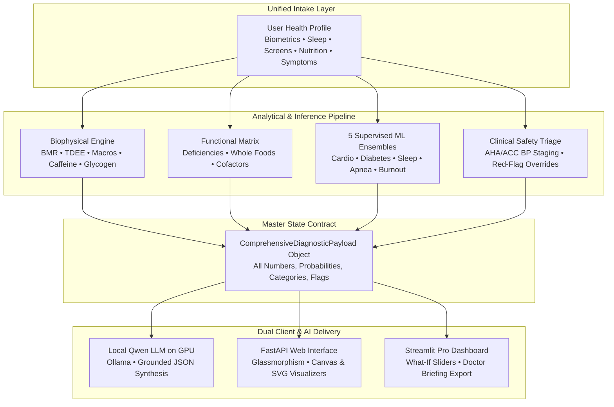

<div align="center">

# 🧬 VitalSync AI
### **A Homogeneous, Scientifically Grounded, Local-First Health & Circadian Intelligence Engine**

[](https://python.org)
[](https://fastapi.tiangolo.com)
[](https://streamlit.io)
[](https://scikit-learn.org)
[](https://ollama.ai)
[-success.svg?logo=pytest&logoColor=white)](file:///tests/)
[](file:///LICENSE)
[](https://sdgs.un.org/goals/goal3)

*Eliminating health anxiety (cyberchondria) through validated biophysics, calibrated machine learning on 500,000+ CDC records, deterministic 3-tier clinical triage, and local GPU LLM synthesis with zero cloud telemetry.*

[Key Features](#-key-features) • [System Architecture](#-system-architecture) • [Machine Learning Models](#-machine-learning-models--validation) • [Quickstart Guide](#-quickstart-guide) • [API Reference](#-rest-api-overview) • [Full Documentation](#-comprehensive-documentation-suite)

</div>

---

> ### ⚖️ STATUTORY ETHICAL DISCLAIMER & MEDICAL SCOPE
> **VITALSUNC AI PROVIDES LIFESTYLE, BEHAVIORAL, AND WELLNESS OPTIMIZATION ANALYSIS DESIGNED TO REDUCE EVERYDAY HEALTH ANXIETY. IT DOES NOT PROVIDE MEDICAL DIAGNOSES, CLINICAL TREATMENT, PRESCRIPTION RECOMMENDATIONS, OR THERAPY.**
>
> All machine-learning risk percentages and nutritional indices are statistical indicators based on epidemiological cohorts. They are not a substitute for clinical judgment by a licensed medical professional. If you experience severe, persistent symptoms or acute emergency signs (e.g., blood pressure $\ge 180/120\,\text{mmHg}$, crushing chest pressure, shortness of breath, sudden numbness or speech difficulty), call emergency services (911 / 112) or seek urgent emergency room care immediately.

---

## 📖 Table of Contents
- [Executive Overview](#-executive-overview)
- [The Cyberchondria Crisis](#-the-cyberchondria-crisis)
- [System Architecture](#-system-architecture)
- [Key Features](#-key-features)
- [Machine Learning Models & Validation](#-machine-learning-models--validation)
- [The 3-Tier Clinical Safety Triage Engine](#-the-3-tier-clinical-safety-triage-engine)
- [Local-First Privacy & GPU Architecture](#-local-first-privacy--gpu-architecture)
- [Quickstart Guide](#-quickstart-guide)
- [REST API Overview](#-rest-api-overview)
- [Automated Testing & Verification](#-automated-testing--verification)
- [Repository Structure](#-repository-structure)
- [Comprehensive Documentation Suite](#-comprehensive-documentation-suite)
- [Citation & License](#-citation--license)

---

## 🌟 Executive Overview

**VitalSync AI** is an all-in-one, offline-first health platform engineered to bridge the dangerous gap between alarmist online health searches and ungrounded, hallucinating cloud AI chatbots. 

Rather than relying on isolated toy calculators or speculative prompts, VitalSync AI operates on a single, homogeneous data contract (`UserHealthProfile`) orchestrated through a multi-stage clinical intelligence pipeline:

1. **Deterministic Biophysical Engine**: Mifflin-St Jeor & Katch-McArdle BMR, dynamic macronutrient partitioning, 1st-order caffeine elimination pharmacokinetics ($t_{1/2} = 5.5\text{h}$), and fluid/glycogen mass variance equations.
2. **Supervised Epidemiological Ensembles**: 5 machine learning pipelines trained on over **500,000+ authentic public health records** (CDC BRFSS Heart Disease, BRFSS Diabetes 50/50, Sleep Health & Apnea, Kaggle Bedtime Screentime, and Student Lifestyle cohorts).
3. **Functional Micronutrient Knowledge Graph**: A bidirectional knowledge matrix connecting everyday subjective symptoms to nutritional cofactors, bioavailable whole-food sources, and absorption inhibitors.
4. **Three-Tier Clinical Safety Guardrails**: Deterministic AHA/ACC blood pressure classification and red-flag emergency overrides (`Level 1 Green`, `Level 2 Yellow`, `Level 3 Red Emergency Override`).
5. **100% Local GPU LLM Synthesis**: Local Python ML combined with local Qwen via Ollama on GPU (`http://localhost:11434`). The LLM acts purely as an empathetic translator of verified, pre-computed JSON diagnostic payloads—zero numbers are hallucinated, and zero data leaves your machine.
6. **Dual Reactive Interfaces**: A modern HTML5/CSS3 glassmorphic web app served via FastAPI (<30ms API latency), alongside a Streamlit Pro dashboard with real-time "What-If" counterfactual simulations and 1-click standardized Doctor Briefing exports.

---

## 🧠 The Cyberchondria Crisis

When individuals experience everyday bodily signals—such as an eyelid twitch after coffee or a normal 1.5 kg scale jump after a pasta dinner—their first reaction is often to search online. Commercial search engines rank catastrophic worst-case scenarios, sparking acute health anxiety (**cyberchondria**):

```
┌────────────────────────────────────────────────────────────────────────────────────────┐
│ TRADITIONAL ONLINE HEALTH SEARCH                       VITALSUNC AI DE-ESCALATION       │
├───────────────────────────────────────────────────────┬────────────────────────────────┤
│ ❌ Eyelid twitch ➔ Motor Neuron Disease / ALS         │ ✅ Benign neuromuscular twitch  │
│ ❌ Scale +1.5kg ➔ Rapid fat gain                      │ ✅ Glycogen-water mass balance │
│ ❌ Afternoon fatigue ➔ Chronic organ failure          │ ✅ Circadian dip & hydration   │
│ ❌ Fragmented, siloed web calculators                 │ ✅ Single homogeneous pipeline│
│ ❌ Cloud data logging & telemetry                     │ ✅ 100% Localhost GPU privacy  │
│ ❌ Ungrounded LLMs hallucinating medical numbers      │ ✅ Pre-computed math & ML truth│
└───────────────────────────────────────────────────────┴────────────────────────────────┘
```

VitalSync AI demystifies bodily signals with calm biological explanations, de-escalating anxiety while enforcing strict clinical boundaries.

---

## 🏛️ System Architecture



---

## ✨ Key Features

### 1. Dual Intake Experience
- **⚡ Quick 2-Minute Health Pulse**: Minimal demographic, vitals, bedtime screen time, and top symptoms intake for daily tracking.
- **🔬 Deep Clinical Lifestyle Intake**: Comprehensive evaluation covering waist circumference, body fat percentage, chronotype, airway markers, dietary habits, and resistance training.

### 2. Validated Biophysical Mathematical Engine
- **BMR / TDEE**: Automatic selection between Mifflin-St Jeor and Katch-McArdle equations.
- **Goal-Calibrated Macronutrients**: Precision protein ($1.6\text{--}2.0\,\text{g/kg}$), essential fat floor ($0.6\,\text{g/kg}$ minimum), and activity-timed carbohydrates.
- **First-Order Caffeine Pharmacokinetics**: Real-time clearance curve ($t_{1/2} = 5.5\text{h}$) calculating active serum caffeine at bedtime and alerting if $>25\,\text{mg}$.
- **Scale Weight Fluctuation Bounds**: Calculates intracellular water bound to stored glycogen ($3\text{--}4\,\text{g}$ water per gram of glycogen) plus sodium shifts to eliminate scale panic.

### 3. Functional Micronutrient Knowledge Matrix
- Traverses symptom vectors to identify potential nutritional deficiencies (Magnesium, Ferritin, Vitamin B12, Vitamin D3, Zinc).
- Details whole-food sources, synergistic cofactors (e.g., Vitamin C with iron; Vitamin K2 with D3), and dietary inhibitors (tannins, phytates).

### 4. Interactive "What-If" Counterfactual Simulator
- Live sliders let users test lifestyle modifications in real time (e.g., reducing bedtime phone usage by 30 mins, increasing steps to 10,000, sleeping 1 extra hour) and observe their risk dials move dynamically.

### 5. "Am I Okay?" 60-Second Symptom De-escalator
- Interactive modal providing instant, evidence-grounded reassurance for common somatic panics (post-coffee heart thumping, eyelid twitches, sudden scale jumps).

### 6. Standardized 1-Page "Doctor Visit Briefing"
- Generates a clinical Markdown summary of patient vitals, sleep architecture, and risk scores, designed to be printed and brought to a physician's appointment.

---

## 🤖 Machine Learning Models & Validation

VitalSync AI integrates **5 independent machine learning pipelines** trained on authentic public health datasets:

| Model Pipeline | Dataset Source | Training Cohort | Architecture | Primary Metric |
| :--- | :--- | :--- | :--- | :--- |
| **1. 10-Yr Cardiovascular Risk** | CDC BRFSS 2020 (`heart_2020_cleaned.csv`) | **319,795 rows** | Balanced Logistic Regression | **ROC-AUC: 0.817** |
| **2. Pre-Diabetes Screener** | CDC BRFSS 2015 50/50 (`diabetes_binary_5050split.csv`) | **70,692 rows** | HistGradientBoostingClassifier | **ROC-AUC: 0.819** |
| **3. Circadian Sleep Latency & Debt** | Bedtime Screen Time Cohort (`bedtime_screentime.csv`) | **8,500 rows** | Multi-Output Regressor / Classifier | **Latency RMSE: 6.84m** |
| **4. Sleep Pathology & Apnea Triage** | Clinical Polysomnography (`Sleep_health.csv`) | **374 clinical records** | Balanced Random Forest | **Weighted F1: 0.893** |
| **5. Digital Stress & Screen Burnout** | Student Lifestyle Cohort (`student_lifestyle.csv`) | **100,000 rows** | HistGradientBoosting Reg / Clf | **Stress RMSE: 1.48 / 10** |

*All serialized model bundles are lightweight (~3.5 MB total) and tracked in [`models/`](file:///models/) for instant out-of-the-box execution.*

---

## 🚨 The 3-Tier Clinical Safety Triage Engine

Implemented in [`safety_triage.py`](file:///safety_triage.py), the platform evaluates every user profile against clinical safety guardrails:

```
┌────────────────────────────────────────────────────────────────────────────────────────┐
│                              3-TIER CLINICAL TRIAGE ENGINE                             │
├───────────────────────┬───────────────────────────────┬────────────────────────────────┤
│ Triage Level          │ Clinical Criteria             │ System Action                  │
├───────────────────────┼───────────────────────────────┼────────────────────────────────┤
│ 🟢 LEVEL 1: GREEN     │ Vitals & habits within normal │ Self-directed lifestyle advice │
│ (Lifestyle Modifiable)│ physiological ranges.         │ and habit coaching enabled.    │
├───────────────────────┼───────────────────────────────┼────────────────────────────────┤
│ 🟡 LEVEL 2: YELLOW    │ Stage 1/2 Hypertension, high  │ Lifestyle advice displayed with│
│ (Clinical Review)     │ Apnea risk, pre-diabetes flag.│ prominent PCP checkup banner.  │
├───────────────────────┼───────────────────────────────┼────────────────────────────────┤
│ 🔴 LEVEL 3: RED       │ BP ≥ 180/120 mmHg, acute chest│ IMMEDIATE INTERFACE LOCKOUT:   │
│ (EMERGENCY OVERRIDE)  │ pressure, focal deficits.     │ Directs user to 911 / 112 / ER.│
└───────────────────────┴───────────────────────────────┴────────────────────────────────┘
```

---

## 🔒 Local-First Privacy & GPU Architecture

VitalSync AI adheres to a strict **100% Offline Privacy Mandate**:
- **Zero Cloud Transmission**: All biometrics, questionnaire responses, and symptom logs stay on your local computer.
- **Local ML & GPU LLM**: Machine learning inference runs in local Python (<10ms). The LLM is hosted locally on your GPU via Ollama (`http://localhost:11434`), eliminating third-party data tracking.
- **Anti-Hallucination Prompt Boundary**: The LLM is provided the exact pre-computed JSON diagnostic payload. It interprets existing verified metrics without inventing medical numbers.

---

## ⚡ Quickstart Guide

### 1. Prerequisites
- **Python 3.10+**
- *(Optional, for AI synthesis)* [Ollama](https://ollama.ai) installed and running:
  ```bash
  ollama run qwen3.5:0.8b
  ```

### 2. Installation
```bash
# Clone the repository
git clone https://github.com/vitalsync-ai/vitalsync-ai.git
cd vitalsync-ai

# Create and activate virtual environment
python -m venv .venv

# Windows:
.venv\Scripts\activate
# Linux/macOS:
source .venv/bin/activate

# Install dependencies
pip install -r requirements.txt
```

### 3. Launching the Platform

#### Option A: Modern Glassmorphic Web App (FastAPI)
```bash
uvicorn api_server:app --port 8000 --reload
```
Open your browser at: **`http://localhost:8000`**

#### Option B: Streamlit Pro Dashboard
```bash
streamlit run app.py
```
Open your browser at: **`http://localhost:8501`**

---

## 🌐 REST API Overview

The FastAPI backend provides sub-30ms endpoints for programmatic health intelligence:

```bash
# 1. System Health Check
curl -X GET "http://localhost:8000/api/health"

# 2. Run Full Diagnostic Analysis (<30ms)
curl -X POST "http://localhost:8000/api/analyze" \
     -H "Content-Type: application/json" \
     -d '{
       "age": 32, "sex": "male", "height_cm": 178, "weight_kg": 78,
       "systolic_bp": 124, "diastolic_bp": 78, "resting_hr_bpm": 68,
       "daily_steps": 7500, "actual_sleep_hours": 7.0, "daily_caffeine_mg": 180,
       "symptoms": ["eyelid_twitch"]
     }'

# 3. Export 1-Page Doctor Briefing
curl -X POST "http://localhost:8000/api/export-doctor-briefing" \
     -H "Content-Type: application/json" \
     -d '{ "age": 32, "sex": "male", "height_cm": 178, "weight_kg": 78, "systolic_bp": 124, "diastolic_bp": 78 }'
```

*For complete endpoint schemas and payload documentation, see [docs/API_DOCUMENTATION.md](file:///docs/API_DOCUMENTATION.md).*

---

## 🧪 Automated Testing & Verification

VitalSync AI maintains **100% passing automated test coverage** across all biological calculators, machine learning pipelines, triage overrides, and orchestrator components:

```bash
pytest
```

```
============================= test session starts =============================
platform win32 -- Python 3.13.13, pytest-9.1.1, pluggy-1.6.0
rootdir: C:\Users\salman\Desktop\p2
collected 24 items

tests\test_phase1.py .................                                   [ 70%]
tests\test_phase2.py ..                                                  [ 79%]
tests\test_phase3_4.py .....                                             [100%]

============================= 24 passed in 3.54s ==============================
```

---

## 📁 Repository Structure

```
vitalsync-ai/
├── schemas.py              # Central Pydantic state contracts (UserHealthProfile, DiagnosticPayload)
├── calculators.py          # Validated biophysical math (Mifflin, Katch, Caffeine, Glycogen)
├── deficiency_matrix.py    # Functional medicine symptom-to-micronutrient knowledge graph
├── ml_inference.py         # Singleton inference engine for 5 ML models & counterfactuals
├── safety_triage.py        # AHA/ACC BP staging & red-flag clinical guardrails
├── orchestrator.py         # Central pipeline coordinator & Doctor Briefing generator
├── llm_advisor.py          # Local Qwen LLM connector via Ollama with prompt guardrails
├── api_server.py           # Production FastAPI asynchronous REST server
├── app.py                  # Streamlit Pro reactive dashboard
├── train_models.py         # Retraining pipeline for all 5 machine learning models
├── requirements.txt        # Production dependency specifications
├── pyproject.toml          # PEP 517/621 packaging metadata
├── LICENSE                 # MIT License with Statutory Health Disclaimer
├── CONTRIBUTING.md         # Open-source contribution guidelines & the 7 directives
├── CITATION.cff            # Citation Metadata for research and papers
├── PROJECT_DESCRIPTION.md  # High-impact executive abstract and problem formulation
├── models/                 # Pretrained scikit-learn pipelines (~3.5 MB total)
├── web/                    # Modern glassmorphism web frontend (HTML5/CSS3/Vanilla JS)
├── datasets/               # Public health datasets provenance & schemas
├── docs/                   # Full technical report, API docs, architecture, user guide
└── tests/                  # 24 automated unit and integration tests
```

---

## 📚 Comprehensive Documentation Suite

- 📑 **[Project Description & Abstract](file:///PROJECT_DESCRIPTION.md)**: Deep dive into the public health rationale, cyberchondria epidemic, and UN SDG 3 alignment.
- 🔬 **[Comprehensive Technical & Scientific Report](file:///docs/COMPREHENSIVE_TECHNICAL_REPORT.md)**: 360-degree whitepaper detailing mathematical derivations, ML training configurations, ROC-AUC curves, and biophysical mechanics.
- 🌐 **[REST API Documentation](file:///docs/API_DOCUMENTATION.md)**: Complete endpoint reference, JSON schemas, curl examples, and Python clients.
- 🏛️ **[System Architecture Blueprint](file:///docs/ARCHITECTURE.md)**: Architectural diagrams, pipeline lifecycles, and security threat models.
- 📖 **[User & Clinician Manual](file:///docs/USER_GUIDE.md)**: Step-by-step user guide for everyday users, wellness coaches, and primary care doctors.
- 📊 **[Datasets & Provenance Guide](file:///datasets/README.md)**: Sources, sample distributions, and retraining instructions for CDC and Kaggle datasets.

---

## 📜 Citation & License

### Citation
If you use VitalSync AI in your academic research, epidemiological modeling, or health technology project, please cite it as:

```bibtex
@software{vitalsync_ai_2026,
  author = {VitalSync AI Platform Contributors},
  title = {VitalSync AI: A Homogeneous, Scientifically Grounded, Local-First Health & Circadian Intelligence Platform},
  year = {2026},
  url = {https://github.com/vitalsync-ai/vitalsync-ai},
  license = {MIT}
}
```

### License
Released under the open-source **[MIT License](file:///LICENSE)**. Includes mandatory non-diagnostic healthcare and wellness disclaimers.
