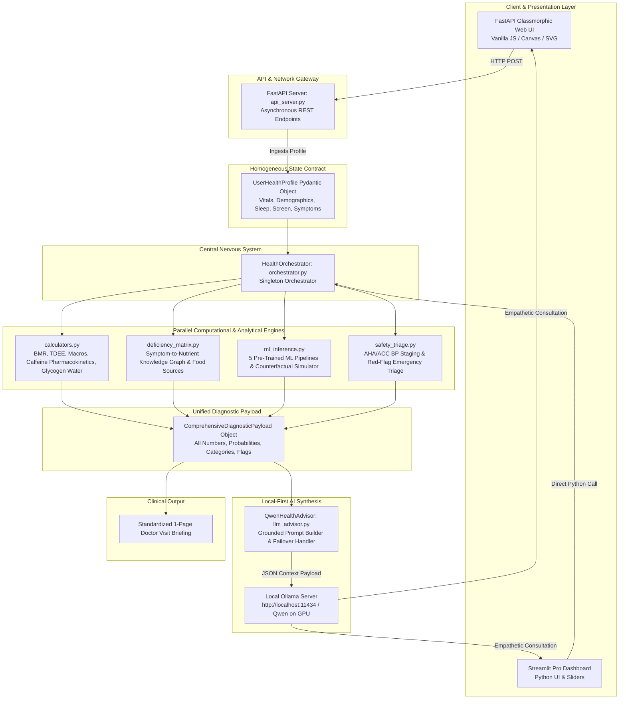

# VitalSync AI: System Architecture Blueprint

This document details the architectural design, component interactions, dataflow contracts, and security boundaries of the **VitalSync AI** health platform.

---

## 🏛️ High-Level Architectural Flowchart



---

## 🧩 Architectural Design Principles

VitalSync AI is built on five core engineering principles:

### 1. Homogeneous State Contract (Zero Siloed Data)
Traditional health applications split user data across disparate scripts and databases. VitalSync AI enforces a single, authoritative schema contract: [`UserHealthProfile`](file:///schemas.py). Every subsystem—from metabolic math to machine learning models and LLM prompts—consumes this identical profile.

### 2. Zero-Hallucination Separation of Concerns
Large Language Models are non-deterministic and prone to mathematical and clinical fabrication. VitalSync AI solves this by strictly separating **Computation** from **Interpretation**:
- **Computation**: Executed entirely by deterministic Python algorithms and calibrated scikit-learn models. All numbers are pre-computed, verified, and clamped.
- **Interpretation**: Local Qwen receives a completed, locked JSON payload. Its only role is to translate pre-computed numbers into clear, compassionate, and anxiety-reducing human language.

### 3. Localhost-First Privacy Architecture
All components run exclusively on the user's local hardware:
- ML inference runs in the local Python process.
- LLM inference runs on the local GPU via Ollama.
- No network requests leave `127.0.0.1`.

### 4. Deterministic Clinical Safety Gatekeeper
Before any lifestyle guidance is rendered, the payload must pass through [`safety_triage.py`](file:///safety_triage.py). If a Level 3 emergency condition is detected (e.g., blood pressure $\ge 180/120\,\text{mmHg}$, acute cardiac signs), the orchestrator triggers an **Emergency UI Override**, suppressing lifestyle tips and directing the user to emergency services.

---

## 🔬 Component Breakdown & File Taxonomy

```
p2/
├── schemas.py              # Pydantic state contracts (UserHealthProfile, DiagnosticPayload)
├── calculators.py          # Deterministic biophysical math (Mifflin, Katch, Caffeine, Glycogen)
├── deficiency_matrix.py    # Functional medicine symptom-to-micronutrient knowledge graph
├── ml_inference.py         # Singleton inference engine for 5 ML models & counterfactuals
├── safety_triage.py        # AHA/ACC BP staging & red-flag clinical guardrails
├── orchestrator.py         # Central pipeline coordinator & Doctor Briefing markdown generator
├── llm_advisor.py          # Local Qwen LLM connector via Ollama with prompt guardrails
├── api_server.py           # Production FastAPI asynchronous REST server
├── app.py                  # Streamlit Pro reactive dashboard
├── train_models.py         # Training pipeline for all 5 ML models
├── models/                 # Pretrained scikit-learn pipelines (.joblib)
├── web/                    # Modern glassmorphism frontend (HTML5/CSS3/Vanilla JS)
│   ├── index.html
│   ├── css/style.css
│   └── js/app.js, charts.js
├── datasets/               # Public health datasets provenance & schemas
├── docs/                   # Full technical reports & API specifications
└── tests/                  # Automated pytest verification suite (24 passing)
```

---

## ⚡ Execution Pipeline Lifecycle

When a user submits a health profile, the pipeline executes sequentially in under **30 milliseconds**:

```
Step 1: Intake & Validation
        • Incoming JSON validated against UserHealthProfile schema (Pydantic v2).
        • Constraints enforced (age, BMI bounds, blood pressure ranges).

Step 2: Biophysical Calculations (< 1ms)
        • BMR calculated via Mifflin-St Jeor or Katch-McArdle.
        • TDEE computed using activity coefficient, daily steps, and resistance training.
        • Dynamic macros partitioned (protein, essential fat floor, remaining carbs).
        • First-order caffeine half-life curve evaluated at bedtime (t_1/2 = 5.5h).
        • Scale weight fluctuation boundaries and glycogen-water mass calculated.

Step 3: Micronutrient Knowledge Graph Matching (< 1ms)
        • Reported symptom set S evaluated against deficiency matrices.
        • Confidence scores, whole-food sources, cofactors, and inhibitors extracted.

Step 4: Machine Learning Inference Ensembles (~ 4ms)
        • Singleton MLInferenceEngine transforms inputs into standardized feature vectors.
        • 10-Yr Cardiovascular Risk probability computed (CDC 319k model).
        • Pre-Diabetes probability computed (CDC 70k 50/50 model).
        • Circadian Sleep Latency, Fatigue, and Sleep Debt category predicted.
        • Clinical Sleep Apnea vs. Insomnia classified (Random Forest).
        • Digital Screen Burnout & Stress score evaluated (100k model).
        • Counterfactual "What-If" scenarios pre-computed.

Step 5: Clinical Safety Triage (< 0.1ms)
        • Evaluates AHA/ACC blood pressure thresholds and clinical red flags.
        • Assigns TriageLevel: Green (Lifestyle), Yellow (Clinical Check), or Red (Emergency).

Step 6: Diagnostic Payload Packaging (< 1ms)
        • Bundles all results into ComprehensiveDiagnosticPayload.
        • Returned immediately to the client UI.

Step 7: Local Qwen Synthesis (Asynchronous / On Demand, 1-2s)
        • If requested, payload JSON injected into local Qwen LLM via Ollama on GPU.
        • Streams personalized, anxiety-reducing consultation report.
```

---

## 🔒 Security & Privacy Threat Model

| Threat Vector | Mitigation Strategy in VitalSync AI |
| :--- | :--- |
| **Data Interception & Man-in-the-Middle** | Zero external network transmission. All traffic bound to loopback `127.0.0.1`. |
| **Cloud Data Leakage & Ad Tracking** | Zero third-party analytics, tracking pixels, or cloud databases. No telemetry. |
| **AI Hallucination & Medical Misinformation** | All numbers, percentages, and risk scores computed by validated Python code prior to LLM prompt injection. The LLM is prohibited from diagnosing. |
| **Emergency Masking** | Deterministic clinical triage overrides all AI responses during acute crises (BP $\ge 180/120$, acute dyspnea, chest pressure). |
| **Adversarial Prompt Injection** | Structured JSON schema validation strictly bounds LLM input parameters. |
