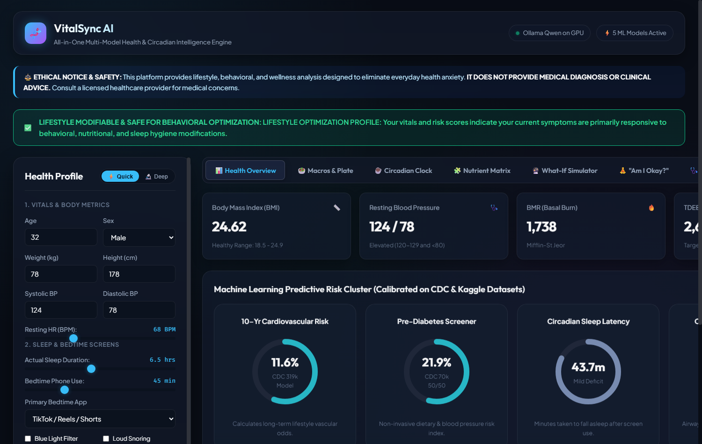
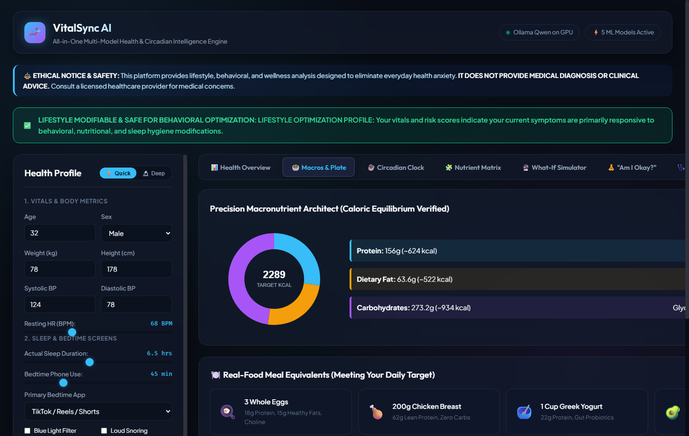
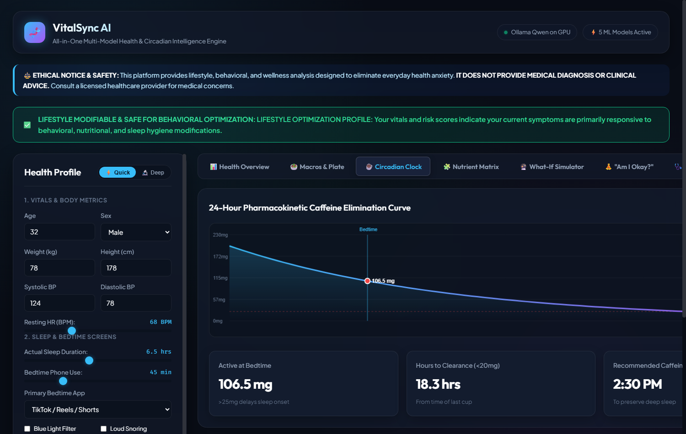
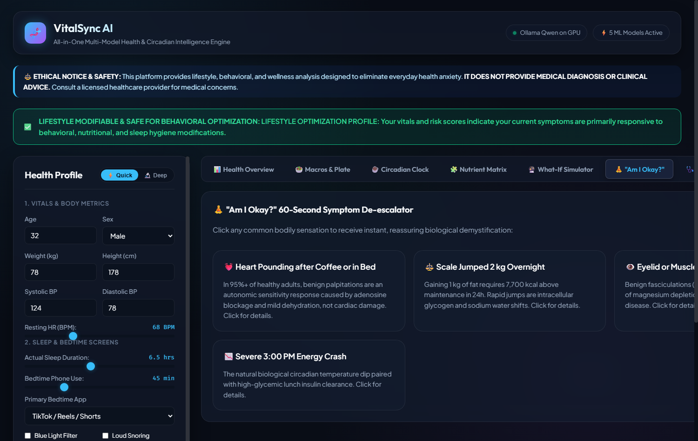
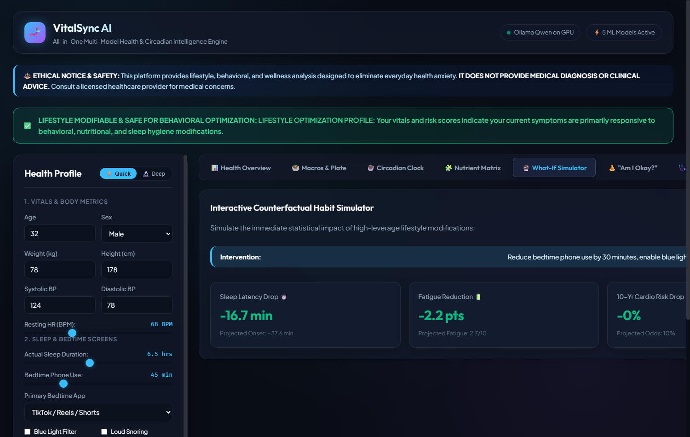
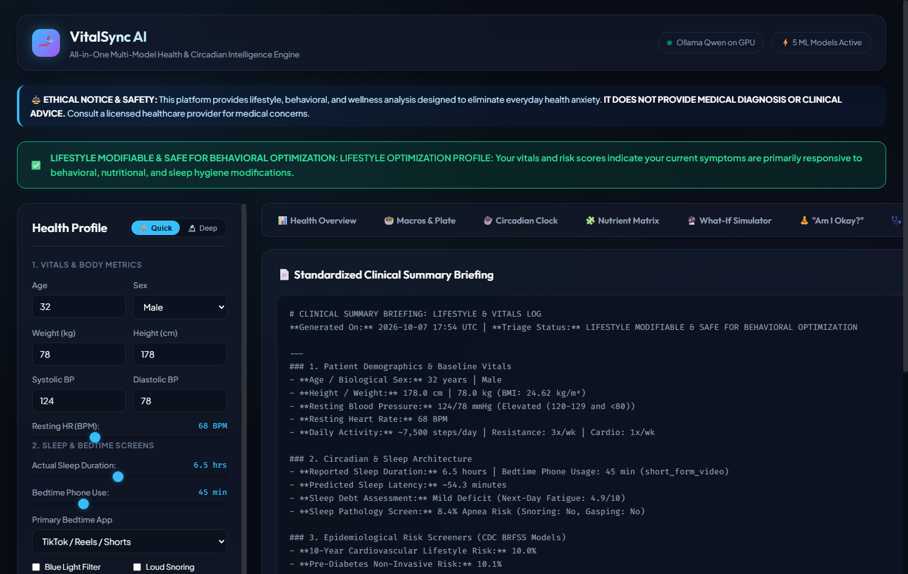

# VitalSync AI: User & Clinician Manual

Welcome to **VitalSync AI**! This guide walks you through using the platform, interpreting your health and biophysical metrics, running real-time simulations, and generating standardized briefings for your primary care doctor.

---

## 🚀 Getting Started

### Prerequisites
1. **Python 3.10+** installed on your computer.
2. *(Optional for AI Chat)* **Ollama** installed with `qwen3.5:0.8b` (or another model) running on your local GPU.

### Starting the Platform
You have two modern interfaces to choose from:

#### Option A: Modern Glassmorphic Web App (Recommended)
```bash
uvicorn api_server:app --port 8000 --reload
```
Open your browser and navigate to: **`http://localhost:8000`**

#### Option B: Streamlit Pro Dashboard
```bash
streamlit run app.py
```
Open your browser and navigate to: **`http://localhost:8501`**

---

## 📝 1. Health Intake: Quick vs. Deep Modes

In the left panel of the interface, you can toggle between two intake modes:

### ⚡ Quick Mode (2-Minute Health Pulse)
Ideal for daily check-ins or rapid screening:
- Age, Biological Sex, Height, and Weight.
- Resting Blood Pressure & Resting Heart Rate.
- Bedtime Screen Time (minutes) & Bedtime App Category.
- Daily Caffeine Intake (mg) & Last Cup Timing.
- Top Active Symptoms (multi-select pills).

### 🔬 Deep Mode (Comprehensive Clinical Lifestyle Intake)
Enables complete epidemiological screening and body-composition modeling:
- Waist circumference and Body Fat Percentage (activates Katch-McArdle BMR).
- Sleep architecture: Sleep latency, actual hours, chronotype, snoring, and apnea markers.
- Nutrition details: Water intake, fruit/vegetable servings, fast-food frequency.
- Movement profile: Daily step count, resistance training frequency, cardio sessions.
- Substance intake: Alcohol frequency and smoking/vaping status.
- Goal selection: Aggressive Fat Loss, Moderate Deficit, Maintenance Recomp, or Lean Bulk.

---

## 🛡️ 2. Understanding the Clinical Safety Triage Banner

At the top of the dashboard, you will see a prominent dynamic triage banner:

| Triage Status | Color | What It Means | Action Required |
| :--- | :--- | :--- | :--- |
| **🟢 Level 1: Lifestyle Optimization** | Green | All baseline vitals (BP, HR, Sleep) are within safe, modifiable limits. | Focus on self-directed behavioral adjustments (hydration, sleep curfew, macros). |
| **🟡 Level 2: Clinical Review Recommended** | Yellow | An anomalous pattern was detected (e.g., Stage 1/2 Hypertension, elevated pre-diabetes risk, suspected Sleep Apnea). | Continue lifestyle optimization, but schedule a routine checkup with your primary care doctor. |
| **🔴 Level 3: Emergency Clinical Warning** | Red | **Critical red flag detected** (e.g., Blood Pressure $\ge 180/120\,\text{mmHg}$, acute chest pain, sudden numbness/slurred speech). | **Immediate lockout**: All lifestyle tips are suppressed. Call emergency services (911 / 112) or go to the nearest ER. |

---

## 📊 3. Interpreting the 5 Risk Gauges



The central scorecard displays five calibrated risk dials:

1. **10-Year Cardiovascular Lifestyle Risk (CDC BRFSS Model)**:
   - Evaluates your risk based on 319,795 CDC records.
   - Shows your statistical risk relative to individuals of your demographic and habit profile.
2. **Pre-Diabetes Non-Invasive Risk (CDC BRFSS 50/50 Model)**:
   - Forecasts insulin resistance probability using non-invasive indicators (BP, BMI, diet, activity).
3. **Sleep Debt & Latency Assessment**:
   - Calculates the exact minutes it takes you to fall asleep based on bedtime phone habits and blue light exposure.
   - Categorizes your sleep debt into `Optimal`, `Mild`, `Moderate`, or `Severe`.
4. **Sleep Pathology & Apnea Screener**:
   - Classifies risk of Obstructive Sleep Apnea vs. Insomnia based on resting vitals and airway markers.
5. **Digital Screen Stress & Burnout Score**:
   - Predicts mental burnout on a scale of $1\text{--}10$ based on daily screen and social media exposure.

---

## 🍽️ 4. Precision Nutrition & Macro Plate Visualizer



Navigate to the **Nutrition & Macros** tab to review:
- **BMR & TDEE**: Your baseline resting metabolism and total daily energy expenditure.
- **Goal-Calibrated Caloric Target**: Dynamically adjusted for your chosen goal (deficit vs. surplus).
- **Macro Split (Grams & Calories)**:
  - **Protein**: $1.6\text{--}2.0\,\text{g/kg}$ to preserve muscle mass.
  - **Healthy Fats**: Guaranteed minimum $0.6\,\text{g/kg}$ floor to protect endocrine and hormone health.
  - **Carbohydrates**: Timed to fuel daily cognitive and physical demands.
- **Hydration Target & Electrolyte Balance**: Tailored to your body mass and exercise volume.
- **Scale Weight Fluctuation Bounds**: Explains why a $1.5\,\text{kg}$ overnight jump is glycogen-bound water, not fat!

---

## ⏰ 5. The 24-Hour Caffeine Curfew Clock



In the **Circadian & Sleep** tab, the platform renders your **First-Order Caffeine Decay Curve**:
- Displays your remaining active serum caffeine at bedtime based on its $5.5\text{-hour}$ elimination half-life.
- If active caffeine exceeds $25\,\text{mg}$ at your target bedtime, the system alerts you and calculates your exact **Recommended Caffeine Curfew** (e.g., "Cut off caffeine after 2:30 PM").

---

## 🧘 6. "Am I Okay?" 60-Second Symptom De-escalator



Experiencing a sudden, worrying sensation? Click the **"Am I Okay?"** button to deconstruct it with reassuring physiology:
- **Post-Coffee Heart Thumping**: Explains transient caffeine-induced sympathetic tone without structural heart defect.
- **Eyelid Twitch (Myokymia)**: Explains neuromuscular hyper-excitability from minor magnesium dip or screen fatigue.
- **Sudden Scale Jump (+1.5 kg)**: Explains glycogen storage ($3\text{--}4\,\text{g}$ water per gram of glycogen) and sodium shifts.
- **Afternoon Brain Fog**: Explains normal circadian post-prandial dips and dehydration.

---

## 🎛️ 7. Interactive "What-If" Counterfactual Simulator



Want to see how changes in your habits would improve your future health?
1. Open the **"What-If" Simulator** tab.
2. Adjust the sliders:
   - *Reduce bedtime phone usage by 30 minutes.*
   - *Increase daily step count to 10,000 steps.*
   - *Add 1 hour to nightly sleep.*
3. Watch the risk dials shift in real time! Observe your predicted sleep latency drop from 38 minutes to 16 minutes and your 10-year cardio risk decline.

---

## 📄 8. Exporting the Standardized "Doctor Visit Briefing"



When preparing for an appointment with your primary care physician:
1. Click the **"Export Doctor Briefing"** button in the top navigation.
2. The platform generates a standardized, 1-page clinical summary in Markdown format.
3. You can copy or print this briefing. It provides your doctor with an organized, objective log of your resting vitals, sleep architecture, and symptom history, saving valuable time during your 15-minute consultation.
